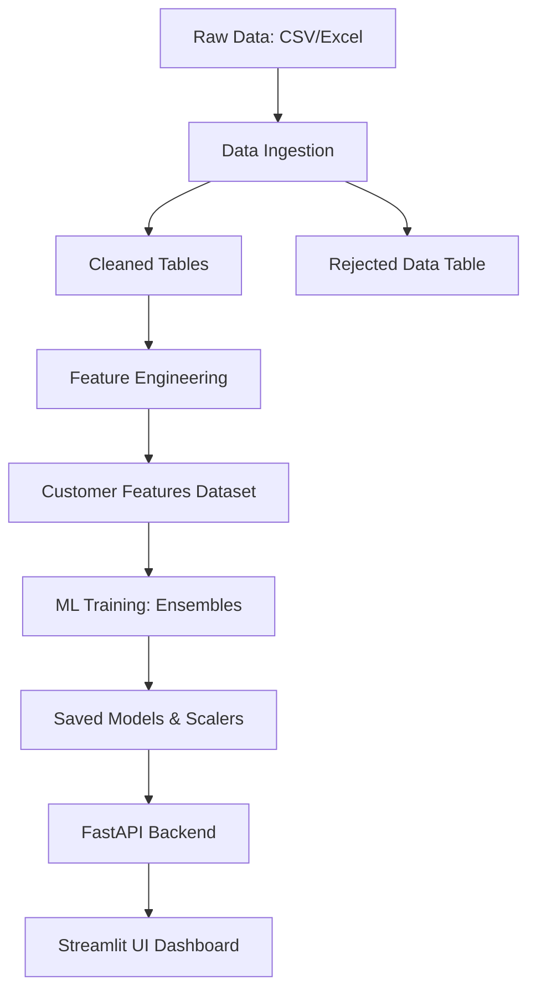

# 30-Day Customer Lifetime Value (CLV) Prediction

This project implements an end-to-end machine learning pipeline to predict the total spend of retail customers in the next 30 days based on their historical transaction behavior.

## 🚀 Project Flow

The project follows a structured architectural flow:



### 1. Data Ingestion & Cleaning
- **Raw Input**: Transaction-level data (e.g., Online Retail II dataset).
- **Validation**: Strict quality rules (positive quantity, non-negative price, valid CustomerIDs).
- **Segregation**: Valid records are split into relational tables (`stores`, `products`, `transactions`). Bad records are stored in `rejected_data` for audit.

### 2. Feature Engineering
- Aggregates transaction history into customer-level behavioral features:
    - **Recency, Frequency, Monetary (RFM)**.
    - **Average Order Value & Products per Order**.
    - **Category Diversity & Unique Product Count**.

### 3. Machine Learning Models
Two stacking ensemble models are trained and compared:
- **Model 1**: Stacking of Random Forest, Ridge, and Lasso.
- **Model 2**: Stacking of Random Forest, XGBoost, Ridge, and Lasso.
- **Hyperparameter Tuning**: Automated via `RandomizedSearchCV`.

### 4. Deployment
- **FastAPI**: Provides high-performance endpoints for real-time predictions.
- **Streamlit**: A dashboard for users to upload files and visualize CLV predictions.

---

## 🛠️ Installation & Setup

### 1. Requirements
Install the necessary Python packages:
```bash
pip install -r requirements.txt
```

### 2. Prepare Data
1. Download the **Online Retail II** dataset from [Kaggle](https://www.kaggle.com/datasets/mashlyn/online-retail-ii-uci).
2. Place the file in `data/raw/`.

---

## 🏃 How to Run

### Step 1: Initialize Database & Load Data
Process the raw file, clean it, and initialize the SQLite database:
```bash
python scripts/download_and_load.py
```

### Step 2: Train the ML Models
Train the ensemble models using the historical data:
```bash
python scripts/run_training.py
```

### Step 3: Launch the Application
Start the backend and frontend services:

**Terminal 1 (Backend API):**
```bash
uvicorn api.main:app --reload --host 0.0.0.0 --port 8000
```

**Terminal 2 (Frontend UI):**
```bash
streamlit run app.py
```

---

## 📊 Using the Dashboard
1. Open the Streamlit URL (default: http://localhost:8501).
2. Use **"Full Pipeline"** mode to clean and predict from a new uncleaned file.
3. Download the resulting CSV containing predictions for:
    - Expected 30-day spend (Model 1 & 2).
    - Predicted number of products.
    - Model R² performance scores.
